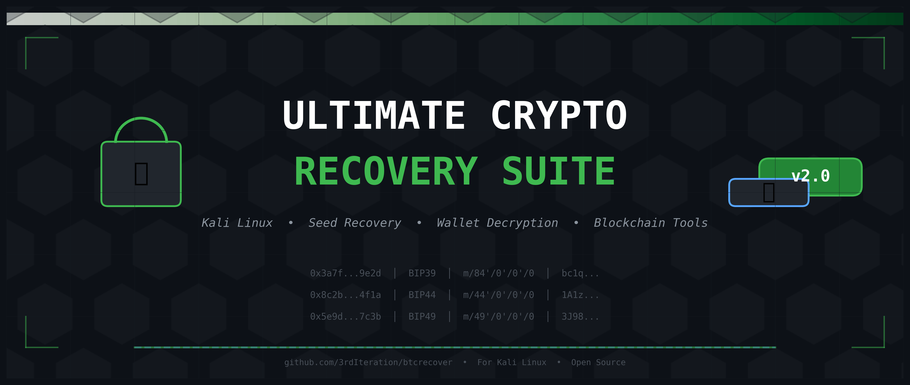

<p align="center">
  
</p>

<h1 align="center">Ultimate Crypto Recovery Suite</h1>

<p align="center">
  <b>One unified recovery tool for Kali Linux</b><br>
  Seed phrases · Wallet passwords · Blockchain scanning · Derivation paths
</p>

<p align="center">
  
  
  
  
</p>

---

## What is this?

A menu-driven bash script that wraps the best open-source crypto recovery tools into one easy-to-use suite. No need to memorize complex commands — just pick your scenario and follow the prompts.

**Tools integrated:**
- **BTCRecover** (3rdIteration) — Seed & password recovery for 40+ wallet types
- **Hashcat** — GPU-accelerated wallet password cracking
- **John the Ripper** — CPU-based password cracking
- **bitcoin2john** — Extract hashes from wallet.dat
- **Blockchair API** — Multi-chain balance checking

---

## Installation

### 1. Clone the repository

```bash
git clone https://github.com/marcus7745/crypto-recovery-suite.git
cd crypto-recovery-suite
```

### 2. Make it executable

```bash
chmod +x crypto-recovery-suite.sh
```

### 3. Run the installer

```bash
./crypto-recovery-suite.sh
```

Then select **1) Install / Update Suite**. This downloads BTCRecover with all submodules and installs Python dependencies.

---

## Quick Start

After installation, simply run:

```bash
./crypto-recovery-suite.sh
```

Or create a permanent alias:

```bash
echo 'alias recover="~/crypto-recovery-suite/crypto-recovery-suite.sh"' >> ~/.zshrc
source ~/.zshrc
recover
```

---

## Main Menu

```
  1) Install / Update Suite
  2) Seed Phrase Recovery
  3) wallet.dat Recovery
  4) Ethereum Recovery
  5) Address & Balance Tools
  0) Exit
```

All outputs are logged to `~/.crypto-recovery-suite/logs/` with timestamps.

---

## Scenarios

### A — Missing Words in Seed

You know most of your 12/24-word seed but 1-4 words are missing.

```
Menu: 2 → 1
Seed: become trash inhale raise mansion length accident improve point lens ? ?
Address: bc1qygvuja4jq4nar209n3w09tyc98095c9lsz8a60
```

BTCRecover tries every valid BIP39 word in the missing positions and stops when a match is found.

### B — Scrambled Seed

You have all 12 words but they're in the wrong order.

```
Menu: 2 → 2
Words: word1 word2 word3 word4 word5 word6 word7 word8 word9 word10 word11 word12
```

> ⚠️ Practical only for 12-word seeds on consumer hardware.

### C — Wrong / Mismatch Words

Your seed was written down incorrectly.

```
Menu: 2 → 3
Seed: word1 word2 WRONG word4 ... word12
Typos: 1
```

### D — BIP39 Passphrase (25th Word)

You know the seed but forgot the extra passphrase.

```
Menu: 2 → 4
```

Provide a **tokenlist** file with password patterns.

### E — wallet.dat Password (BTCRecover)

```
Menu: 3 → 1
Wallet: /path/to/wallet.dat
Tokenlist: /path/to/tokens.txt
```

### F — wallet.dat Password (Hashcat GPU)

```
Menu: 3 → 2
```

Auto-extracts hash with `bitcoin2john.py` and runs `hashcat -m 11300`.

### G — wallet.dat Password (John CPU)

```
Menu: 3 → 3
```

### H — Ethereum Seed Recovery

```
Menu: 4 → 1
Seed: word1 ? word3 ...
Address: 0x...
```

### I — Generate Address Database

Recover seeds without a known address by checking against the entire blockchain.

```
Menu: 5 → 1
Source: Bitcoin Core blockchain data OR address list file
```

### J — Derivation Path Scanner

Recovered seed shows zero balance? Funds might be on a non-standard path.

```
Menu: 5 → 2
```

Tests: `m/44'/0'/0'/0`, `m/49'/0'/0'/0`, `m/84'/0'/0'/0`, `m/86'/0'/0'/0`, `m/0'/0`

### K — Check Address Balance

```
Menu: 5 → 3
Address: bc1q... or 0x...
```

Queries Blockchair API for balance, received, and transaction count.

---

## Windows Host + Kali VM Setup

If your Bitcoin Core node is on **Windows 11** and Kali runs in **VMware**:

### Option 1 — VMware Shared Folder

1. In VMware (Kali powered off): `VM → Settings → Options → Shared Folders → Always enabled → Add...`
2. Browse to `C:\Users\YOURNAME\AppData\Roaming\Bitcoin`
3. Name it `bitcoin`
4. In Kali:
   ```bash
   sudo mkdir -p /mnt/hgfs
   sudo vmhgfs-fuse .host:/ /mnt/hgfs -o allow_other -o uid=1000
   ```
5. In the suite, use datadir: `/mnt/hgfs/bitcoin`

### Option 2 — Generate DB on Windows

1. Install Python on Windows
2. Clone BTCRecover and run `create-address-db.py`
3. Copy the `.db` file to Kali via drag-and-drop

---

## Security Best Practices

| Rule | Why |
|------|-----|
| **Work offline** | Disconnect internet before entering real seeds |
| **Use copies** | Never touch the original wallet.dat |
| **Move funds immediately** | Send recovered funds to a **new** wallet |
| **Delete logs** | Logs contain sensitive data |
| **Verify everything** | Check balances on multiple block explorers |

### Safe Workflow

```
1. Boot air-gapped machine (or disconnect internet)
2. Run recovery suite
3. Write down recovered seed on paper
4. Reboot and reconnect
5. Import seed into hardware wallet (Ledger/Trezor)
6. Verify balance
7. Create NEW wallet and transfer ALL funds
8. Securely delete all recovery artifacts
```

Delete logs after recovery:

```bash
shred -vfz -n 3 ~/.crypto-recovery-suite/logs/*
rm -rf ~/.crypto-recovery-suite/logs/*
```

---

## Troubleshooting

### `ModuleNotFoundError: No module named 'lib.cardano'`

```bash
cd ~/.crypto-recovery-suite/tools/btcrecover
find lib -type d -exec touch {}/__init__.py \;
```

### `Seed not found`

- Wrong derivation path → try Derivation Path Scanner
- Wrong address type (Legacy vs SegWit vs Native SegWit)
- Try `--big-typos 2` for more wrong words
- Increase `--addr-limit` to 20 or 50

### `ValueError: no block files exist in blocks directory`

Bitcoin Core is not installed. Use an address list file instead, or see [Windows Host + Kali VM Setup](#windows-host--kali-vm-setup).

---

## Quick Reference

| Scenario | Menu | Key Flag |
|----------|------|----------|
| Missing words | 2 → 1 | `--mnemonic "word1 ? word3"` |
| Scrambled | 2 → 2 | `--tokenlist words.txt --dsw` |
| Wrong words | 2 → 3 | `--big-typos 1` |
| BIP39 passphrase | 2 → 4 | `--bip39 --mnemonic "seed"` |
| wallet.dat password | 3 → 1 | `--wallet wallet.dat` |
| wallet.dat Hashcat | 3 → 2 | `hashcat -m 11300` |
| wallet.dat John | 3 → 3 | `john hash.txt` |
| ETH seed | 4 → 1 | `--wallet-type ethereum` |
| AddressDB | 5 → 1 | `create-address-db.py` |
| Path scanner | 5 → 2 | `--pathlist paths.txt` |
| Balance check | 5 → 3 | Blockchair API |

---

## Credits

This suite integrates work from:
- **3rdIteration / Crypto-Guide** — [BTCRecover](https://github.com/3rdIteration/btcrecover)
- **OpenWall** — John the Ripper & bitcoin2john
- **hashcat** — GPU cracking framework
- **Blockchair** — Blockchain API

If this tool helped you recover funds, consider donating to the BTCRecover project:
- **BTC:** `37N7B7sdHahCXTcMJgEnHz7YmiR4bEqCrS`
- **ETH:** `0x72343f2806428dbbc2C11a83A1844912184b4243`

---

## License

MIT License — feel free to use, modify, and share.

---

<p align="center">
  <sub>Built with persistence. Use with caution. Recover with confidence.</sub>
</p>
